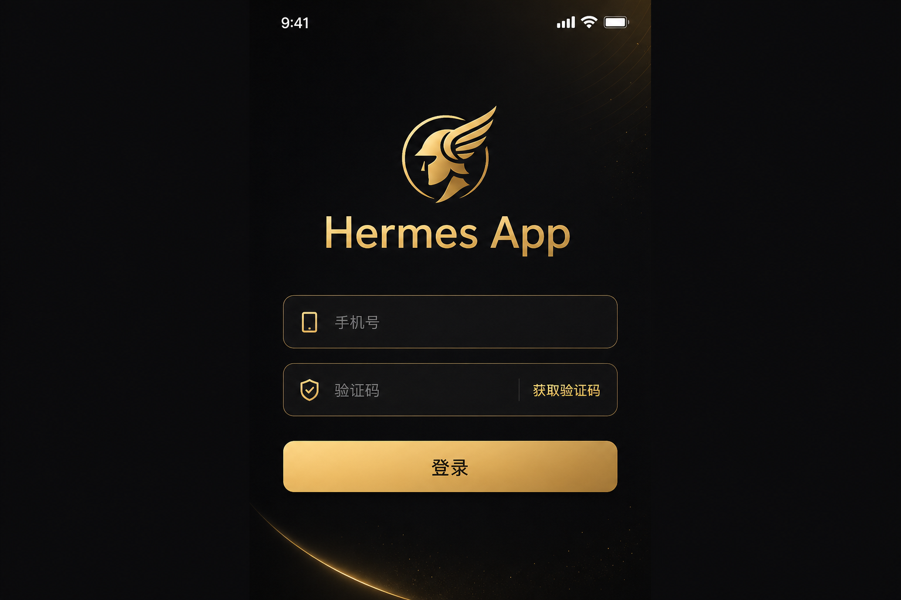
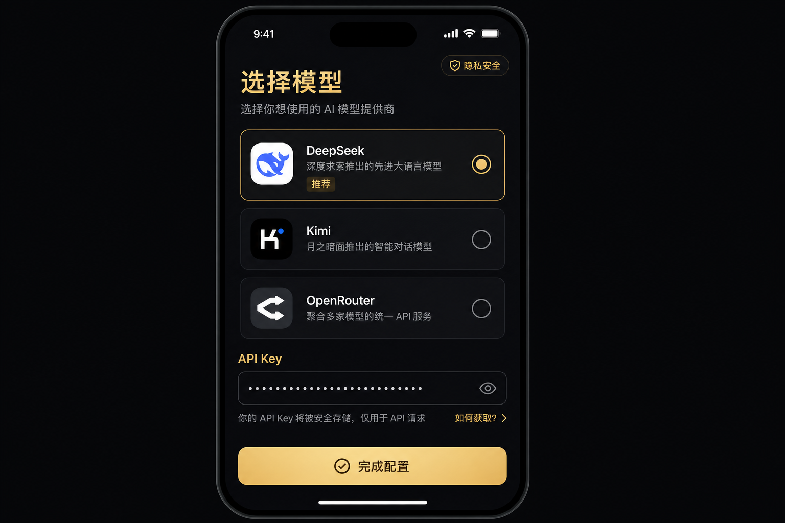
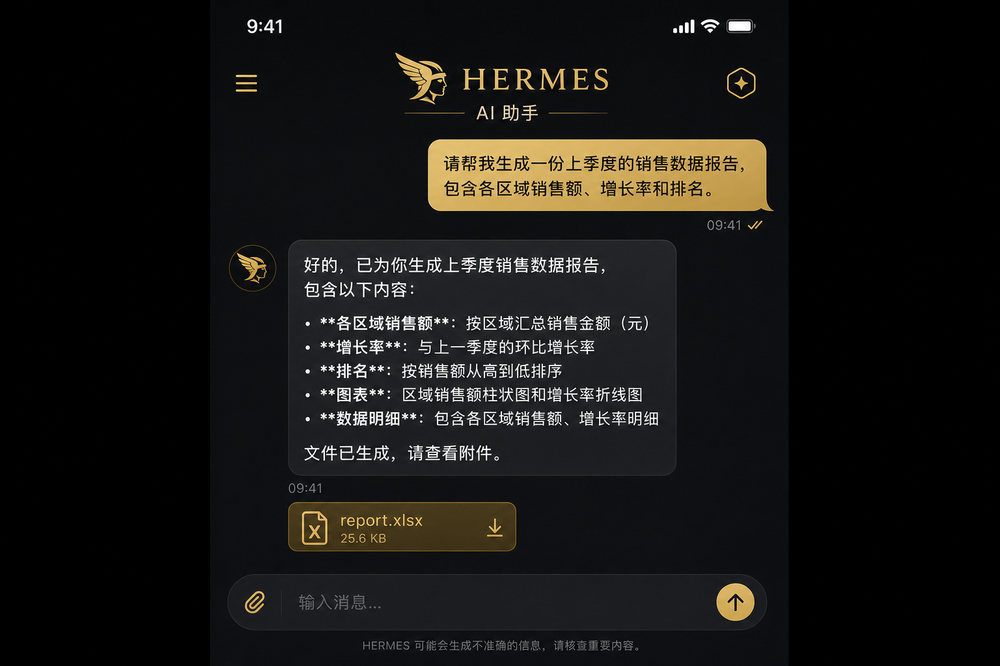
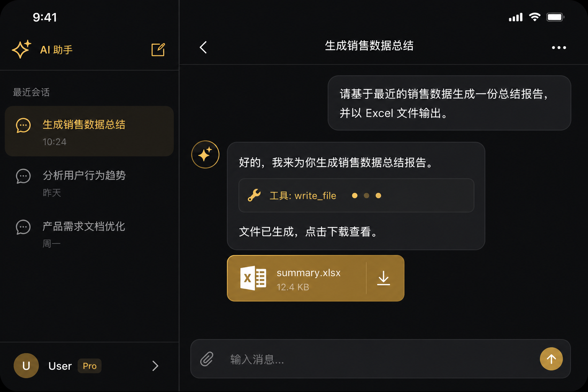
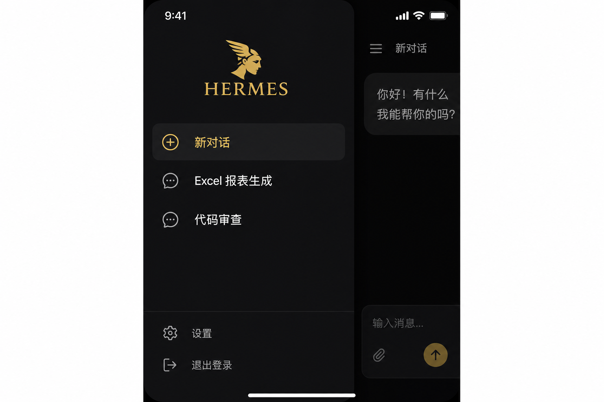

# Hermes App — 单实例多用户版

基于 [Hermes Agent](https://github.com/NousResearch/hermes-agent) 扩展的 **App Gateway** 方案：手机号注册登录、每用户独立工作区与 API Key、Flutter 跨端客户端。

**一台服务器，千人共用** — 单实例架构即可支撑 **1000+ 注册用户** 同时在线使用 App；聊天对话 **100+ 路并发**（SSE 流式），适合企业内测、行业 SaaS、私有化 AI 助手等场景。

## 规模能力

| 指标 | 能力（单实例） | 说明 |
|------|----------------|------|
| **注册用户** | **1000+** | 多租户隔离，每用户独立 workspace / 凭证 / 会话 |
| **聊天并发** | **100+** | 多路 SSE 流式对话同时进行，互不阻塞 |
| **客户端** | Web / iOS / Android | 同一套 Gateway，多端接入 |
| **存储** | PostgreSQL + Redis | 会话、审计、配额可水平扩展依赖层 |

> 实际吞吐与 CPU、内存、模型 API 配额相关；生产环境可按 [配置示例](plugins/app_gateway/config.example.yaml) 调优，需要更高并发可联系商务做集群方案。

## 应用预览

> 下方为 **界面预览图**（用于 README 宣传展示）。建议按 [截图指南](docs/screenshots/HOWTO.md) 替换为你本地运行的真实截图，效果更佳。

<table>
  <tr>
    <td align="center"><b>登录</b><br/></td>
    <td align="center"><b>模型配置</b><br/></td>
    <td align="center"><b>AI 对话</b><br/></td>
  </tr>
  <tr>
    <td align="center"><b>工具与文件</b><br/></td>
    <td align="center"><b>会话管理</b><br/></td>
    <td align="center"><i>更多截图见 docs/screenshots/</i></td>
  </tr>
</table>

## 功能

- **单实例 1000+ 用户**：JWT 多租户，手机号注册登录，每人独立 AI 工作区
- **100+ 路聊天并发**：SSE 流式回复、工具调用、生成文件一键下载
- 每用户隔离的 workspace / 配置 / 凭证
- Flutter 客户端（Web / Android / iOS）
- PostgreSQL + Redis 持久化，可选 MinIO 对象存储

## 快速开始

```bash
# 1. 基础设施
docker compose -f docker-compose.app-gateway-postgres.yml up -d

# 2. 安装（Python 3.11+）
python -m venv .venv && .venv\Scripts\activate   # Windows
pip install -e .

# 3. 配置 ~/.hermes/config.yaml（见下方示例）
hermes app-gateway start

# 4. Flutter Web 客户端
cd plugins/app_gateway/flutter_app
flutter pub get && flutter run -d chrome
```

配置示例：[plugins/app_gateway/config.example.yaml](plugins/app_gateway/config.example.yaml)

详细文档：[plugins/app_gateway/README.md](plugins/app_gateway/README.md)

## 目录

| 路径 | 说明 |
|------|------|
| `plugins/app_gateway/` | 后端 Gateway + Flutter App |
| `plugins/app_admin/` | 管理后台（可选） |
| `docker-compose.app-gateway-postgres.yml` | Postgres / Redis / MinIO |
| `tests/plugins/test_app_gateway*.py` | 自动化测试 |

## 安全说明

**不要提交或上传以下内容：**

- `~/.hermes/`（用户数据、会话、API Key）
- `.env` / `.venv/`
- Flutter `build/`、`.dart_tool/`

生产环境请设置强随机 `jwt_secret`，关闭 `expose_dev_code`，并配置真实 SMS 服务商。

## 上游项目

本仓库 fork 自 [NousResearch/hermes-agent](https://github.com/NousResearch/hermes-agent)（MIT License）。完整 Agent 能力、CLI、Gateway 平台集成等请参阅上游文档。

## 商务合作与联系

欢迎就以下方向与我们交流：

- **私有化部署**：单实例 **1000+ 用户 / 100+ 聊天并发** 能力，PostgreSQL / Redis / MinIO 生产环境搭建与调优
- **定制开发**：Flutter 客户端品牌化、短信登录对接、模型与工具链集成
- **技术咨询**：架构评审、安全加固、**高并发扩容**与性能压测方案

| 渠道 | 说明 |
|------|------|
| GitHub Issues | [提交 Bug / 功能建议](https://github.com/bnba917-debug/hermes-app/issues)（技术问题优先走此渠道，便于追踪） |
| 微信 | `yj_15071534336`（添加时请备注 **hermes-app** 及合作方向） |

> 个人微信仅用于商务沟通与试用交流，非实时技术支持；紧急问题请尽量通过 Issues 描述复现步骤。

## License

MIT — 见 [LICENSE](LICENSE)。
